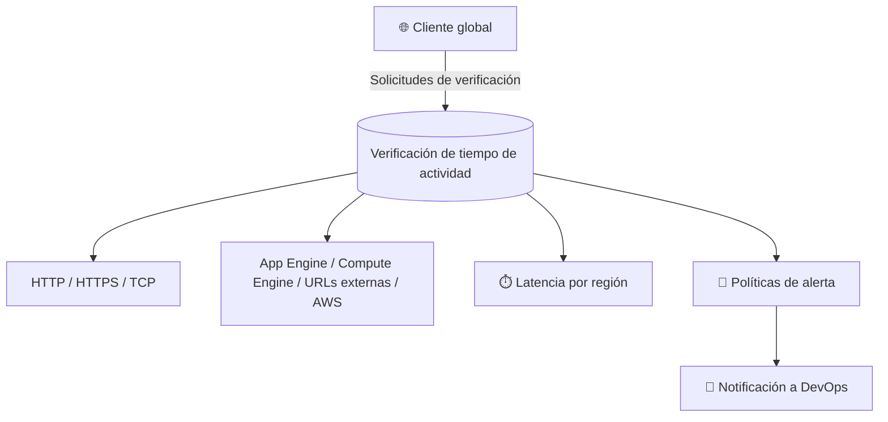

# 📅 Día 098 – Verificaciones de tiempo de actividad en Cloud Monitoring

## 📌 Tema

Supervisión de disponibilidad con verificaciones de tiempo de actividad.

---

## 📘 Descripción

Hoy aprendí sobre las **verificaciones de tiempo de actividad (Uptime Checks)** en **Google Cloud Monitoring**, una herramienta clave para garantizar que los servicios estén siempre disponibles y respondan correctamente desde distintas ubicaciones del mundo 🌍.

Estas verificaciones permiten probar la disponibilidad de **servicios públicos** mediante distintos protocolos (HTTP, HTTPS o TCP) y recursos como:

- Aplicaciones en **App Engine**
- Instancias de **Compute Engine**
- **URLs externas o balanceadores de carga**
- Incluso **instancias AWS**

Cada verificación puede complementarse con una **política de alertas** para detectar fallas y medir la **latencia por región**, ayudando a identificar problemas de conectividad o rendimiento global.

---

## 🛠️ Herramientas utilizadas

- Google Cloud Monitoring
- Alerting Policies
- Uptime Checks (HTTP, HTTPS, TCP)

---

## ✅ Lo que aprendí

- Cómo configurar una **verificación de tiempo de actividad** desde el panel de Monitoring.
- Diferenciar los **tipos de protocolos** y recursos monitoreados.
- Ajustar opciones avanzadas: encabezados personalizados, autenticación, tiempo de espera y ubicaciones globales.
- Crear **alertas automáticas** para notificar cuando un servicio no responde.
- Evaluar **latencia y disponibilidad** de servicios públicos en tiempo real.

---

## 📊 Esquema visual

---

## 📚 Recursos útiles

- [Uptime Checks – Documentación oficial](https://cloud.google.com/monitoring/uptime-checks)
- [Crear políticas de alerta en Cloud Monitoring](https://cloud.google.com/monitoring/alerts)

---

## 🎯 Resultado del día

Configuré una verificación de tiempo de actividad HTTP con alertas automatizadas, validando la disponibilidad y rendimiento de servicios desde distintas regiones globales.

---

## 🤝 Conecta conmigo

- [LinkedIn](https://www.linkedin.com/in/luis-felipe-carrasco/)
- [GitHub](https://github.com/pipeddev/)
